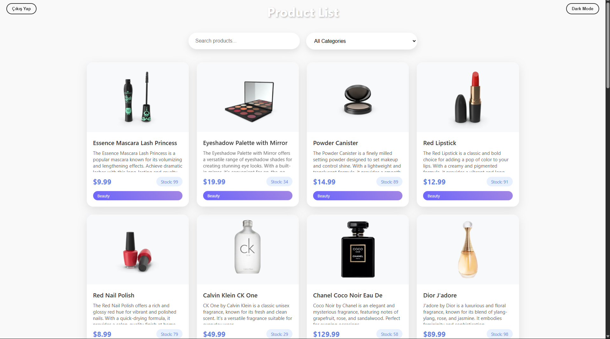
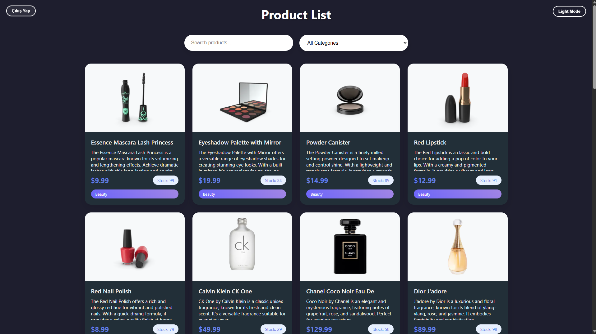
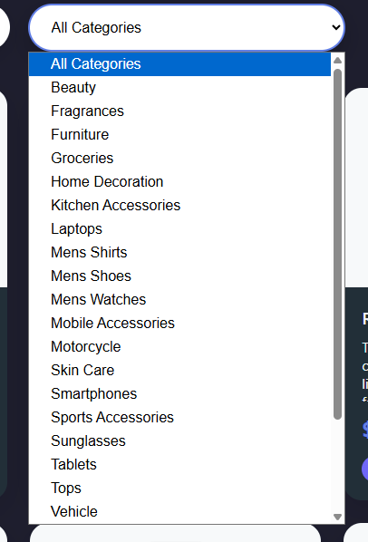
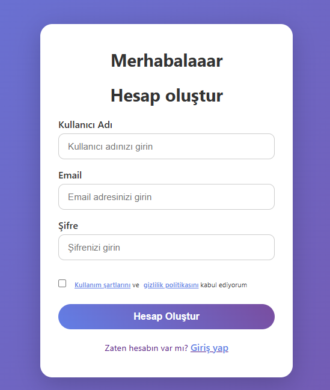

# 🛍️ Product List with useEffect

Bu proje, React'in `useEffect` hook'unu kullanarak hazırlanmış ürün listeleme ve kategori filtreleme uygulamasıdır. Ayrıca karanlık/aydınlık tema desteği ile kullanıcı girişi ve üye olma sayfaları da örneklenmiştir.

## 🚀 Proje Hakkında

- Ürünler `https://dummyjson.com/products` API'sinden çekilir.
- Kategori filtreleme özelliği bulunur.
- Dark ve Light tema desteği vardır.
- Login ve Register sayfaları tasarlanmıştır.
- React fonksiyonel component mimarisiyle geliştirilmiştir.

## 📦 Kullanılan Teknolojiler

- React
- JavaScript (ES6+)
- HTML/CSS
- Fakestore API

## 📸 Ekran Görüntüleri

### 🎨 Tema Görünümleri

#### Light Home


#### Dark Home


### 🗂️ Kategori Filtreleme


### 🔐 Kullanıcı Girişi

#### Login Sayfası


#### Register Sayfası


## 🔧 Kurulum ve Çalıştırma

Projeyi kendi bilgisayarınızda çalıştırmak için şu adımları izleyin:

```bash
# 1. Reposu klonlayın
git clone https://github.com/mehmet2725/product_list_useEffect.git

# 2. Klasöre geçin
cd product_list_useEffect

# 3. Bağımlılıkları yükleyin
npm install

# 4. Uygulamayı başlatın
npm start
